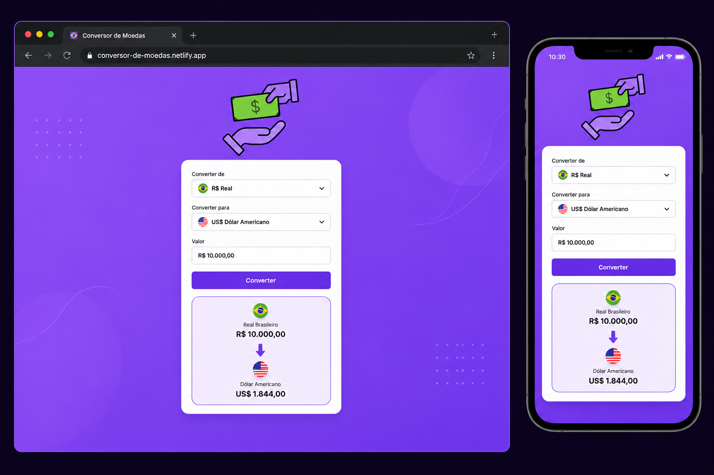

# 💱 Conversor de Moedas

Projeto desenvolvido para praticar HTML, CSS e JavaScript.

## ✨ Funcionalidades

- Conversão entre Real, Dólar, Euro e Libra Esterlina
- Seleção da moeda de origem e destino
- Conversão com um clique
- Interface simples e intuitiva

## 🛠️ Tecnologias Utilizadas

- HTML5
- CSS3
- JavaScript

## 🌐 Acesse o Projeto

Você pode testar a aplicação através do link abaixo:

[Conversor de Moedas](https://christianpinho.github.io/Conversor-de-Moedas/)

## 📈 Melhorias Futuras

- Integração com API de câmbio em tempo real
- Suporte a mais moedas
- Histórico de conversões

## 📚 Aprendizados

Durante o desenvolvimento deste projeto, pratiquei:

* Estruturação de páginas com HTML;
* Estilização com CSS;
* Manipulação do DOM com JavaScript;
* Captura de eventos de clique;
* Lógica de conversão de valores;
* Organização de código em um projeto real.

  ## 📸 Demonstração

  

## 👨‍💻 Autor

Christian Marcel de Pinho
